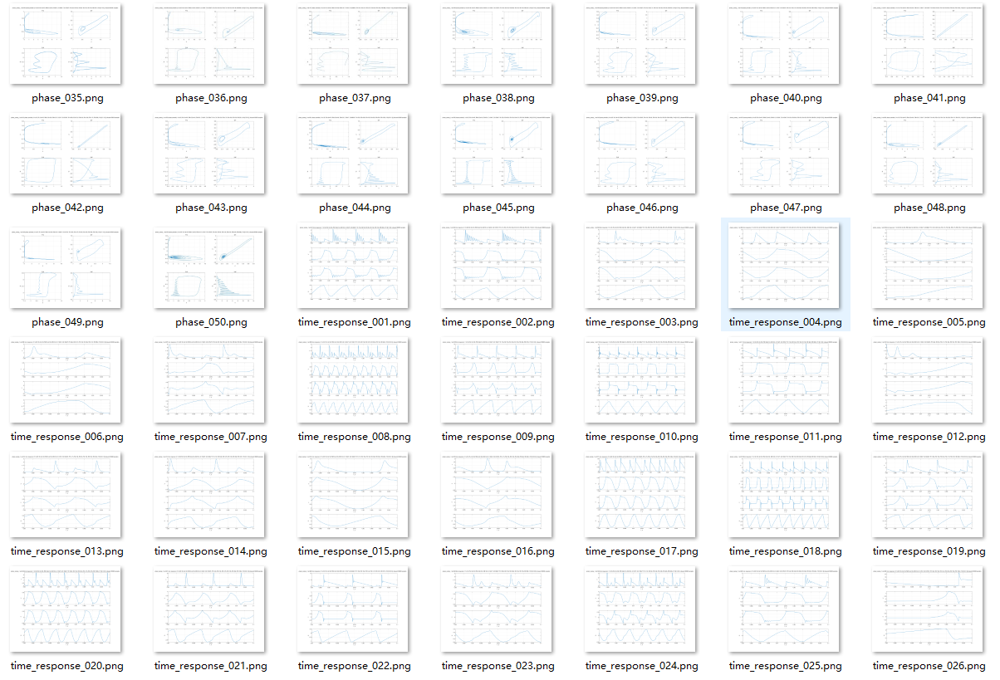

<h1 align="center">Dynamical System Tuner</h1>

<p align="center">
  面向基于 MATLAB 的动力系统参数扫描的 AI agent 工作流。
</p>

<p align="center">
  <a href="LICENSE"></a>
  
  
  
</p>

<p align="center">
  <a href="README.md">English</a> |
  <strong>中文</strong> |
  <a href="README.es-ES.md">Español</a>
</p>

---

## 概述

`dynamical-system-tuner` 是一个面向 AI 编程 agent 的工作流包，用于在 MATLAB 中试验、调节或扫描动力系统参数。

它适用于尚不知道可用参数值、并且用户希望获得有组织的仿真证据的场景：时间响应图、相图、带索引的图像文件，以及用于后续比较的参数日志。

本仓库不绑定到某一个 AI 平台。Codex、Claude Code、基于 ChatGPT 的编程 agent，或任何能够读取项目文件、编辑 MATLAB 脚本并遵循 `SKILL.md` 的 agent 都可以使用它。

| 输入 | Agent 工作流 | 输出 |
| --- | --- | --- |
| 系统方程、状态顺序、仿真设置、初始条件、固定参数、可调参数、约束、瞬态丢弃规则 | 验证信息，创建或修改 MATLAB 扫描脚本，运行或准备带索引的参数试验 | `phase_*.png`、`time_response_*.png`、`parameter_log.csv` |

权威工作流说明文件是 [`dynamical-system-tuner/SKILL.md`](dynamical-system-tuner/SKILL.md)。

## 功能特点

- **面向 agent 的工作流**：为准备或修改 MATLAB 参数试验脚本的 AI agent 提供结构化说明。
- **MATLAB 优先执行**：围绕 MATLAB `.m` 脚本和仓库示例风格设计。
- **参数组扫描**：在保留显式用户约束的同时，试验固定参数和可调参数。
- **可视化比较输出**：为每组参数生成相图和时间响应图。
- **可追踪结果**：在日志中记录参数值、仿真设置、瞬态丢弃设置和失败情况。
- **求解器保持**：除非用户明确要求其他求解器，否则保留自定义 `ode45Ps` 求解器。
- **平台灵活使用**：正式加载 skill 是可选的；agent 也可以直接把 `SKILL.md` 当作工作流规范使用。

## 适用场景

当你希望 AI agent 为以下系统探索参数选择时，可以使用这个工作流：

- 非线性或线性 ODE 系统
- 物理模型或电路模型
- 无量纲化系统
- 纯数学动力系统

典型请求包括：

```text
Tune the parameters of this nonlinear system.
Try several parameter sets and save the phase portraits and time responses.
Modify my MATLAB script to sweep the tunable parameters.
Find usable parameters for this circuit model.
```

这个工作流用于参数发现和可视化比较。它不是最优性、稳定性或分岔结构的证明。

## 必需输入

Agent 不应猜测科学定义或仿真定义所需的信息。在要求 agent 准备或运行参数试验脚本之前，请提供以下项目。

| 必需项目 | 示例 |
| --- | --- |
| 系统方程或状态方程 | `dx/dt = sigma*(y - x)` |
| 状态变量顺序 | `[x, y, z]` |
| 仿真时间范围 | `tspan = 0:0.002:500` |
| 仿真步长 | `step size = 0.002` |
| 初始条件向量 | `Y0 = [1, 1, 1]` |
| 固定参数和值 | `sigma = 10` |
| 可调参数 | `rho`、`beta`、`R2`、`C1` |
| 时间响应瞬态丢弃 | `time_discard = 100` 或 `0` |
| 相图瞬态丢弃 | `phase_discard = 100` 或 `0` |
| 如果模型有输入源，提供源类型和表达式 | `v_source = A*sin(2*pi*f*t + phi)` |
| 参数范围或约束，如有 | `rho between 20 and 40` |

参数组数量是唯一的操作默认值：

```text
Default parameter-set count: 300
```

如果用户请求不同数量，例如 50、500 或 1000，agent 应遵循用户请求的数量。

## 快速开始

1. 将本仓库或 `dynamical-system-tuner/` 文件夹放入 agent 可以读取的项目中。
2. 要求 agent 使用 [`dynamical-system-tuner/SKILL.md`](dynamical-system-tuner/SKILL.md) 中的工作流。
3. 提供必需的系统定义、仿真设置、固定参数、可调参数和瞬态丢弃设置。
4. 让 agent 按照 [`dynamical-system-tuner/scripts/phase_example.m`](dynamical-system-tuner/scripts/phase_example.m) 中的风格创建或修改 MATLAB 参数扫描脚本。
5. 在 MATLAB 中运行脚本，或者在 MATLAB 执行环境可用时让 agent 运行脚本。
6. 检查生成的相图、时间响应图和 `parameter_log.csv`。

## 示例提示词

```text
Use the dynamical-system-tuner workflow in this repository.

I want to trial parameters for this dynamical system.

System:
dx/dt = sigma*(y - x)
dy/dt = x*(rho - z) - y
dz/dt = x*y - beta*z

State order:
[x, y, z]

Simulation:
tspan = 0:0.002:500
step size = 0.002

Initial condition:
Y0 = [1, 1, 1]

Fixed parameters:
sigma = 10

Tunable parameters:
rho
beta

Parameter constraints:
rho between 20 and 40
beta between 2 and 4

Transient discard:
time-response discard = 100
phase-portrait discard = 100

Parameter-set count:
300

Output:
Create phase_sweep_1.m and save figures to sweep_1_output.
```

如果省略 `Parameter-set count`，工作流默认使用 300 组参数。

## 输出

典型的 300 组参数运行会创建带索引的图像和一个 CSV 日志：

```text
sweep_1_output/
|-- phase_001.png
|-- time_response_001.png
|-- phase_002.png
|-- time_response_002.png
|-- ...
|-- phase_300.png
|-- time_response_300.png
`-- parameter_log.csv
```

对于超过 999 组参数的运行，文件名应使用足够的位数以保持排序：

```text
phase_0001.png
time_response_0001.png
phase_1000.png
time_response_1000.png
```

参数日志应记录参数组索引、输出图像名称、固定参数、可调值、初始条件、仿真范围、步长、瞬态丢弃设置、适用时的源表达式，以及失败或发散的情况。

### 示例输出



*连续电路系统的示例输出图像。图片由 Chi CHEN 提供。*

## 仓库结构

```text
dynamical-system-tuner-skill/
|-- README.md
|-- README.zh-CN.md
|-- README.es-ES.md
|-- LICENSE
|-- docs/
|   `-- images/
|       `-- result-example-1.png
`-- dynamical-system-tuner/
    |-- SKILL.md
    `-- scripts/
        `-- phase_example.m
```

- `README.md` 是默认的英文项目入口文档。
- `README.zh-CN.md` 和 `README.es-ES.md` 是翻译版入口文档。
- `dynamical-system-tuner/SKILL.md` 是面向 AI agent 的详细说明文件。
- `dynamical-system-tuner/scripts/` 存放 MATLAB 示例和脚本模式。
- `docs/images/` 存放 README 图像。

## 重要规则

- Agent 不得编造 ODE、仿真时长、步长、初始条件、固定参数值、源表达式、状态变量顺序或瞬态丢弃设置。
- 固定参数保持固定。
- 只有明确列出的可调参数可以被改变。
- 时间响应和相图的瞬态丢弃必须分别提供。没有瞬态需要丢弃时使用 `0`。
- 对于物理系统，尤其是电路系统，除非用户明确要求，否则参数值应保持物理合理性。
- AC 源必须完整定义，并清楚区分可调源量，例如 `A`、`f` 和 `phi`。
- 失败、不稳定或发散的参数组应记录在日志中，而不是被静默丢弃。
- 除非用户明确请求 `ode45`、`ode15s` 或其他求解器，否则保留 `ode45Ps`。

## 许可证

本项目基于 [MIT License](LICENSE) 授权。
